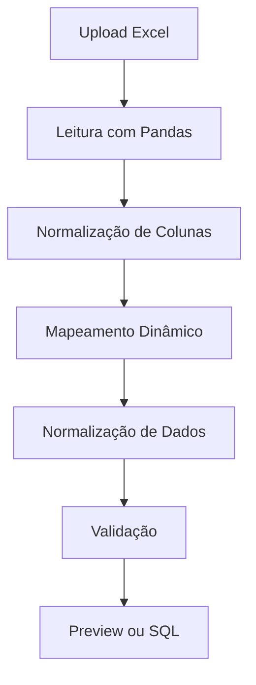

# 🚀 Data Importer Pro — ETL Inteligente para Planilhas Clínicas

Uma solução moderna de **importação, validação e transformação de dados (ETL)** para converter planilhas Excel em comandos SQL estruturados, com suporte a múltiplos domínios como **Pacientes, Procedimentos e Agendamentos**.

> 💡 Projeto desenvolvido com foco em **arquitetura escalável, reutilização de código e qualidade de dados**, simulando cenários reais de integração com sistemas legados.

---

## 🧠 Visão Geral

Este projeto resolve um problema comum em sistemas corporativos:

> ❌ Planilhas inconsistentes
> ❌ Dados despadronizados
> ❌ Processos manuais e suscetíveis a erro

➡️ Transformando tudo isso em:

> ✅ Dados normalizados
> ✅ Estrutura pronta para banco de dados
> ✅ Automação do processo de importação

---

## ⚙️ Arquitetura do Projeto

O sistema foi projetado com separação clara de responsabilidades:

```
📦 backend (FastAPI)
 ┣ 📂 api
 ┣ 📂 transformer
 ┣ 📂 configs
 ┣ 📂 utils

📦 frontend (React + TypeScript)
 ┣ 📂 components
 ┣ 📂 lib
```

### 🔥 Destaques Arquiteturais

* 🔌 **Motor genérico de importação (plugável por config)**
* 🧠 **Normalização dinâmica baseada em regras**
* 🔄 **Separação total entre lógica e configuração**
* 📊 **Sistema de logs para análise de dados**
* 🌐 **API REST desacoplada do frontend**

---

## 🛠️ Tecnologias Utilizadas

### Backend

* 🐍 Python
* ⚡ FastAPI
* 📊 Pandas
* 🧩 Arquitetura modular baseada em configs

### Frontend

* ⚛️ React
* 🟦 TypeScript
* 🎨 TailwindCSS
* 🔄 Fetch API

---

## 🚀 Funcionalidades

### 📥 Importação Inteligente

* Upload de arquivos Excel (.xlsx)
* Mapeamento automático de colunas
* Suporte a nomes variados (sinônimos)

### 🧹 Normalização de Dados

* CPF padronizado (11 dígitos)
* Datas convertidas automaticamente
* Telefones limpos
* Strings tratadas e consistentes

### 🧠 Regras de Negócio

* Campos obrigatórios configuráveis
* Tratamento de dados inconsistentes
* Regras específicas por domínio:

  * Pacientes
  * Procedimentos
  * Agendamentos

### 📊 Preview e Validação

* Visualização dos dados antes do processamento final
* Logs detalhados:

  * CPFs ajustados
  * Nomes vazios
  * Telefones formatados

### 📄 Geração de SQL

* Exportação de comandos INSERT prontos
* Compatível com bancos relacionais

---

## 🔄 Fluxo do Sistema



---

## 🧩 Sistema de Configuração

Cada tipo de importação é isolado em configs:

```python
configs/
 ┣ pacientes.py
 ┣ procedimentos.py
 ┣ agendamentos.py
```

### Exemplo:

```python
COLUNAS_BANCO = [...]
MAPA_COLUNAS = {...}
NORMALIZADORES = {...}
COLUNAS_OBRIGATORIAS = [...]
```

👉 Isso permite escalar o sistema sem alterar o core.

---

## 🌐 API

### Endpoint principal

```
POST /upload
```

### Parâmetros:

| Parâmetro       | Descrição                                |
| --------------- | ---------------------------------------- |
| tipo_importacao | pacientes / procedimentos / agendamentos |
| modo_retorno    | preview / arquivo                        |
| modo_execucao   | validacao                                |

---

### 📥 Exemplo de uso

```
POST /upload?tipo_importacao=pacientes&modo_retorno=preview
```

---

### 📤 Resposta (Preview)

```json
{
  "status": "validacao",
  "preview": [...],
  "total_registros": 100,
  "log": {
    "cpf_ajustados": 10,
    "nomes_vazios": 2
  }
}
```

---

## 🖥️ Frontend

Interface simples e funcional para:

* Upload de arquivos
* Seleção de tipo de importação
* Visualização de preview
* Download do SQL

---

## 🎯 Diferenciais do Projeto

* 💡 Arquitetura baseada em **configuração (config-driven)**
* 🔄 Reutilização total do motor de transformação
* 📊 Observabilidade com logs estruturados
* 🧠 Regras de negócio desacopladas
* ⚡ Performance com Pandas
* 🔌 Fácil expansão para novos tipos de dados

---

## 📈 Possíveis Evoluções

* 📊 Preview em tabela interativa
* 🔐 Autenticação com JWT
* ☁️ Deploy em cloud (AWS / Azure)
* 📦 Upload via S3
* 📉 Dashboard de qualidade de dados
* 🤖 Integração com IA para sugestão de mapeamento

---

## 👨‍💻 Sobre o Projeto

Este projeto foi desenvolvido com foco em:

* Simular desafios reais de mercado
* Demonstrar domínio em **backend + frontend**
* Aplicar conceitos de **engenharia de software moderna**

---

## 📬 Contato

Se quiser trocar ideia ou discutir oportunidades:

📧 [seu-email-aqui]
💼 LinkedIn: [seu-linkedin-aqui]

---

## ⭐ Conclusão

Este projeto vai além de um simples importador:

> É uma base sólida para sistemas de integração de dados em ambientes corporativos.

---

# 🔥 Keywords (para recrutadores)

`ETL` • `Data Processing` • `FastAPI` • `React` • `TypeScript` • `Python` • `Pandas` • `Data Normalization` • `REST API` • `Data Pipeline` • `Software Architecture` • `Scalable Systems` • `Clean Code`

---
